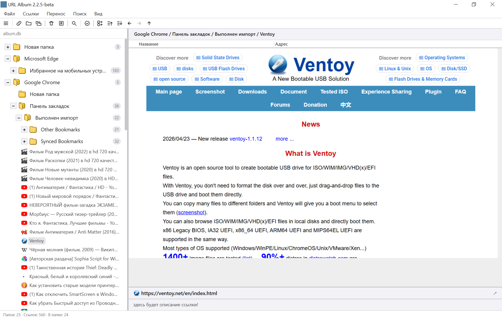
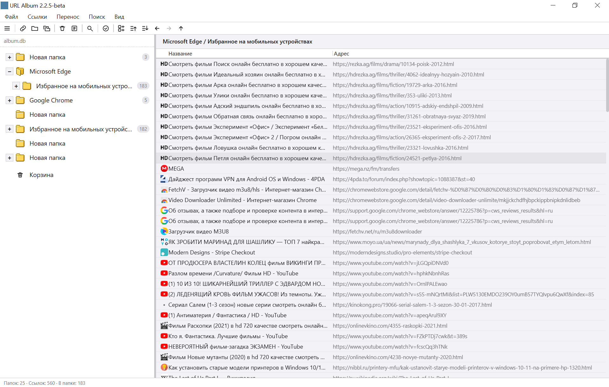
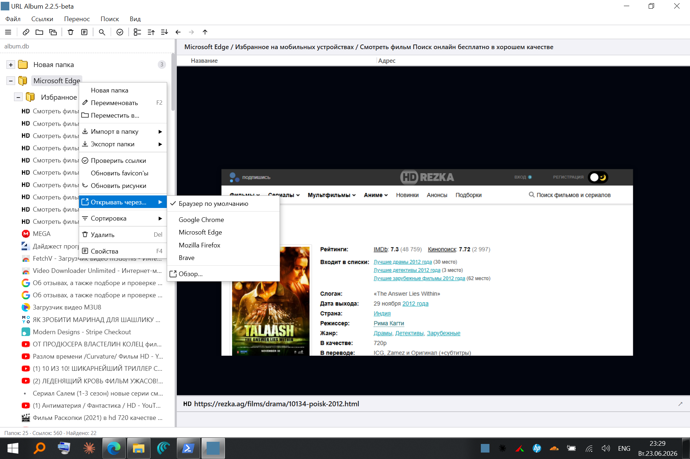
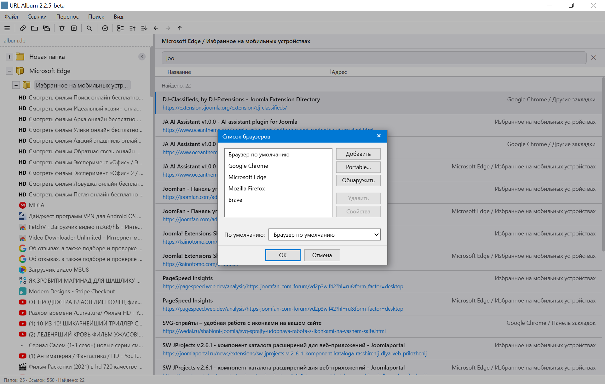
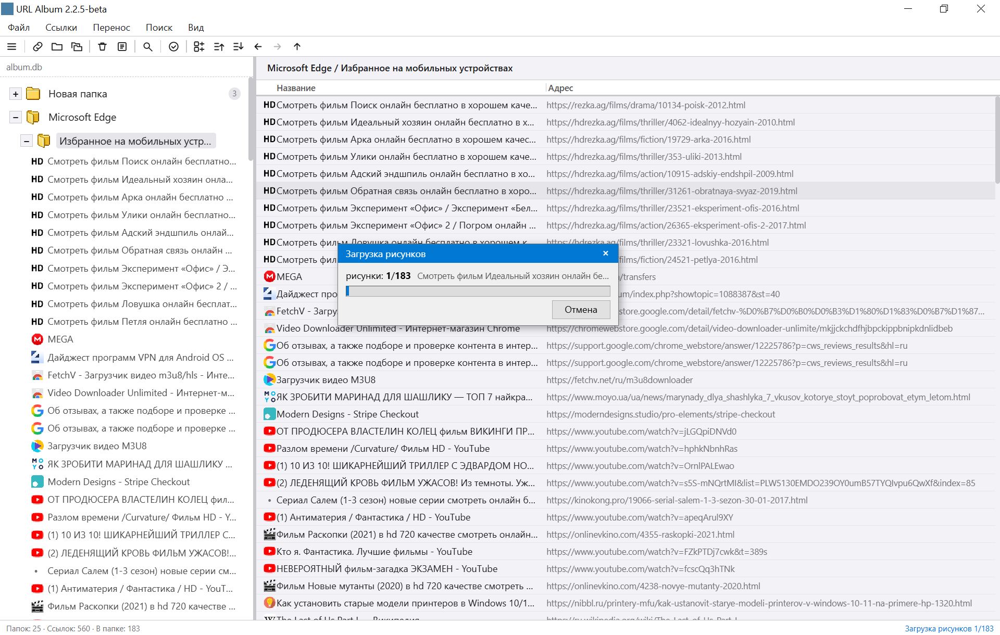
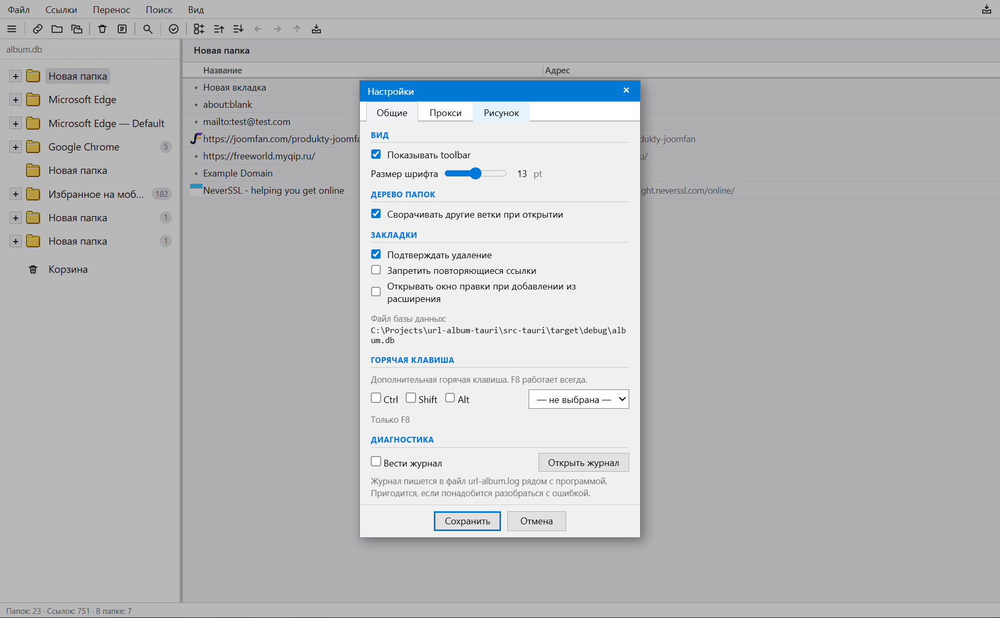
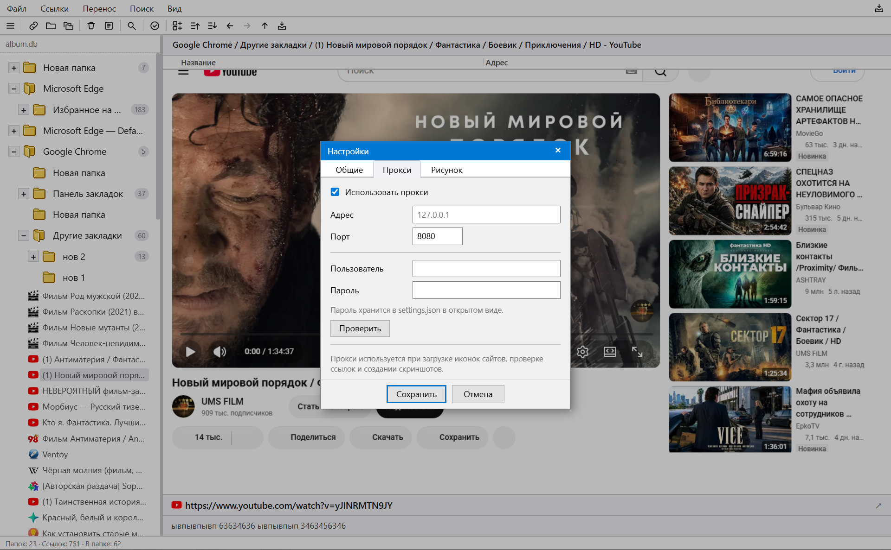
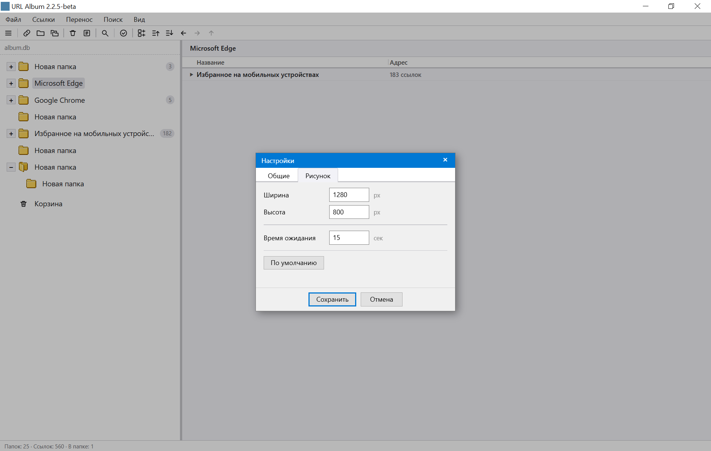
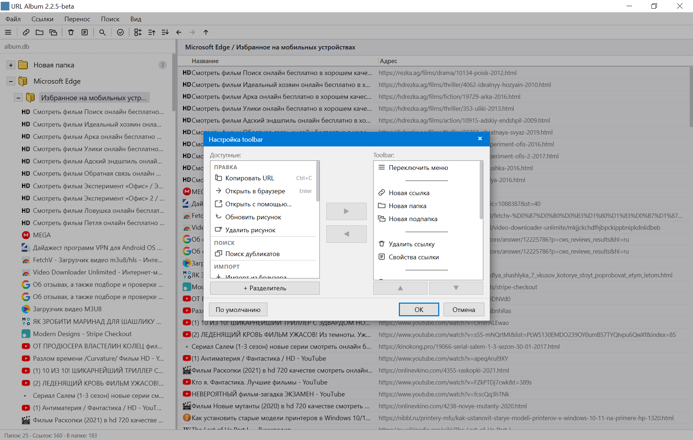

# URL Album

**Современное продолжение классического URL-Album для Windows 10/11.**

Многие помнят URL-Album начала 2000-х — менеджер закладок, который хранил ссылки локально, сопровождал их скриншотами сайтов и позволял организовать коллекцию в удобном дереве папок. В отличие от обычных браузерных закладок, URL-Album показывает коллекцию не только по названиям, но и по изображениям самих сайтов.

Этот проект продолжает идеи классического URL-Album на современных технологиях, сохраняя его главные принципы: локальное хранение, портативность, независимость от браузеров и наглядную работу со ссылками.

Меня всегда привлекала философия URL-Album: небольшая портативная программа, которая делает одну задачу и делает её хорошо. Без облака, без аккаунтов, без подписок. Ваш архив ссылок хранится у вас и принадлежит только вам — в этом дух старых хороших программ.

> **Главное — переносится старая коллекция.**
> Поддерживается импорт баз из оригинального URL-Album (формат ua.dat), поэтому накопленный за годы архив ссылок не нужно собирать заново.

При этом URL Album — не просто копия старой программы, а современное переосмысление: поддержка актуальных браузеров, расширение для быстрого сохранения ссылок, несколько баз данных, резервное копирование и многое, чего раньше не было.

## Наследие URL-Album

> Классический URL-Album (2000-е)
> &nbsp;&nbsp;&nbsp;&nbsp;↓
> URL Album 2 (Windows 7)
> &nbsp;&nbsp;&nbsp;&nbsp;↓
> URL Album (Tauri) — Windows 10 / 11

## Скачать последнюю версию

**[URL Album для Windows 10/11 (64-bit)](https://github.com/skljar/url-album-tauri/releases/latest)** — портативная, установка не требуется.
Требования: WebView2 (уже встроен в Windows 10/11).

## Почему не браузерные закладки?

**Визуальная коллекция со скриншотами.** Каждая ссылка может сопровождаться снимком сайта и значком. Вместо безликих списков — знакомые страницы, которые узнаёшь с одного взгляда.

**Независимость от браузеров.** Закладки в собственной базе, а не внутри Chrome, Firefox или Edge. Сменили браузер — коллекция осталась.

**Локальное хранение.** Без облака, без аккаунтов, без синхронизаций. Данные только на вашем компьютере.

**Переносимость.** Не требует установки, не пишет в реестр, работает даже с флешки. Переживает переустановку Windows.

**Собственный архив надолго.** Коллекция не зависит от браузеров, аккаунтов и облачных сервисов — это ваш архив, который можно хранить и переносить столько, сколько нужно.

## Возможности

**Навигация**
- Дерево папок любой вложенности
- Навигация Назад / Вперёд / Вверх по папкам (как в браузере) + горячие клавиши
- Список ссылок с favicon, изменяемые панели и колонки
- Поиск в реальном времени по названию, адресу и заметкам (Ctrl+F)

**Работа со ссылками**
- Создание, редактирование, удаление; заметки к ссылкам
- Корзина — мягкое удаление с восстановлением
- Открыть в браузере по умолчанию или через «Открывать через…» (выбор браузера для папки)
- Скриншоты сайтов: для одной ссылки или всей папки

**Быстрый доступ**
- Системный трей (показать, добавить из буфера, выход); свернуть в трей — кнопкой в строке меню или через «Файл»
- Глобальная горячая клавиша — добавить ссылку из буфера в любой момент
- Браузерное расширение (Chrome / Edge) — сохранить вкладку одним кликом со скриншотом

**Базы данных**
- Несколько баз с переключением на лету, история последних баз
- Резервные копии (со скриншотами и без)
- Всё рядом с программой, реестр не трогается

**Импорт и экспорт**
- Импорт: оригинальный URL-Album (ua.dat), браузеры (Chrome, Edge, Brave, Opera, Firefox — все профили), HTML-закладки, другие базы URL Album
- Экспорт: HTML, TXT, файл синхронизации (JSON)

**Инструменты**
- Поиск дубликатов, проверка доступности ссылок
- Настройка панели инструментов и размера шрифта
- Прокси: HTTP-прокси для значков сайтов, проверки ссылок и скриншотов, в том числе с логином и паролем; кнопка проверки подключения
- Журнал для диагностики (выключен по умолчанию)

## Скриншоты

*Дерево папок и список ссылок с иконками сайтов*

*Карточка ссылки со скриншотом сайта; выбор браузера для открытия*

*Поиск в реальном времени; список браузеров для импорта и открытия*

*Пакетное обновление скриншотов для всей папки*

*Настройки: размер шрифта, горячая клавиша, дерево папок, диагностика*

*Настройка прокси: адрес, порт, логин и пароль; кнопка «Проверить» сразу сообщает, работает ли подключение*

*Настройки скриншотов: размер и время ожидания*

*Гибкая настройка панели инструментов*

## Установка

1. Скачайте и распакуйте ZIP в любую папку.
2. Запустите `URL-Album.exe`.
3. Папку `extension` не удаляйте — она нужна для расширения (инструкция в `README.txt` внутри архива).

## Технологии

Tauri 2 + Rust + SQLite + Vanilla JS. Портативный exe ~8,7 МБ, без внешних зависимостей (WebView2 — системный компонент Windows 10/11).

## Статус

Beta — в активной разработке. Баги и пожелания — в Issues. Особенно интересны отзывы тех, кто работал с классическим URL-Album: что было важно тогда и чего не хватает сейчас.
