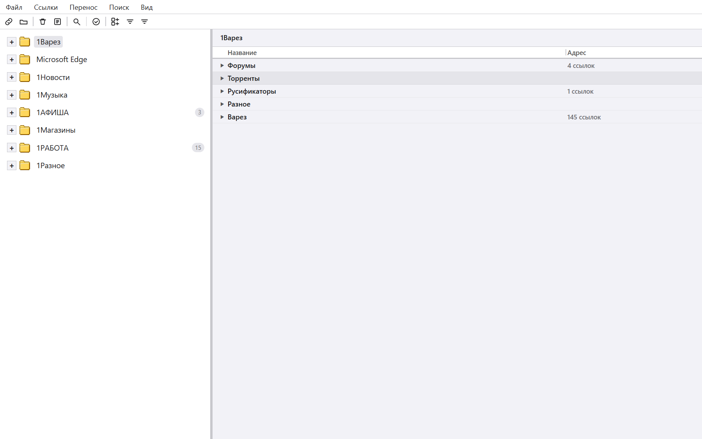
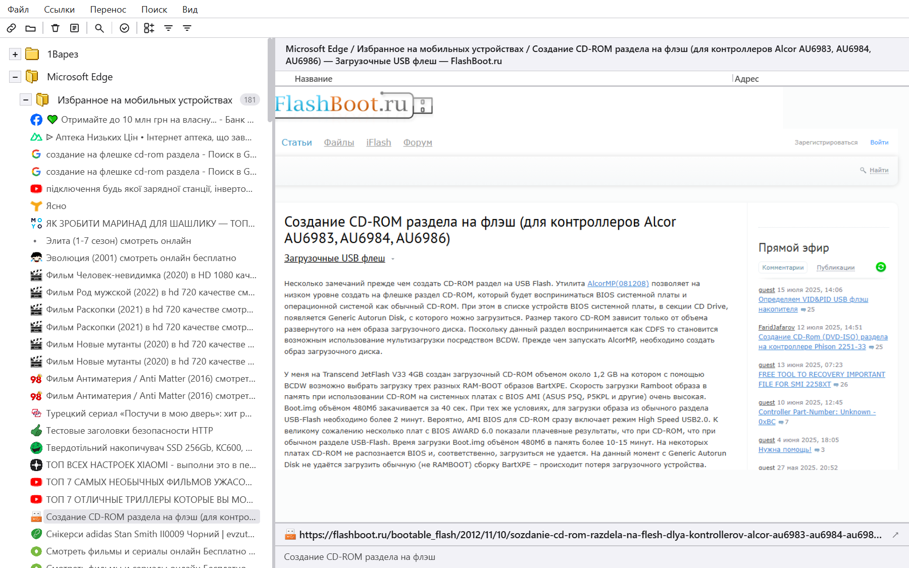
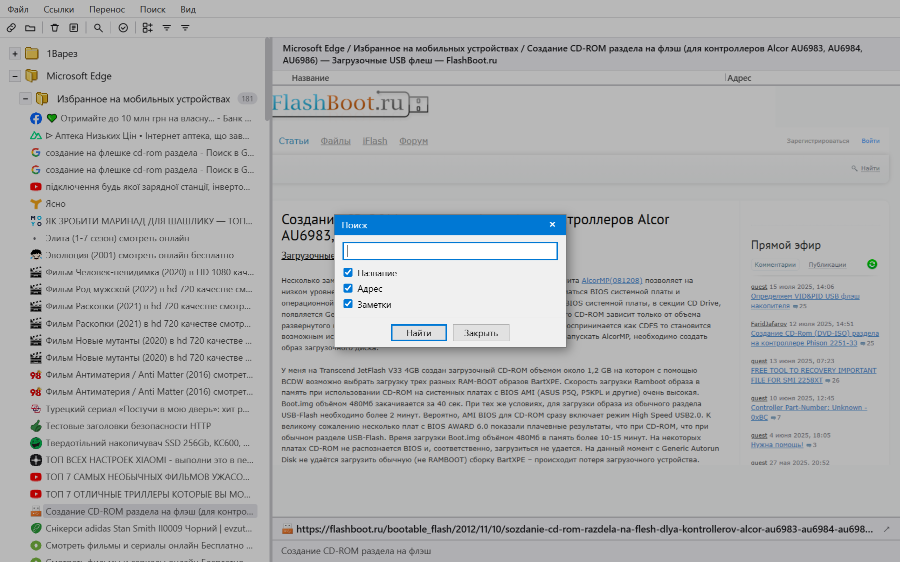
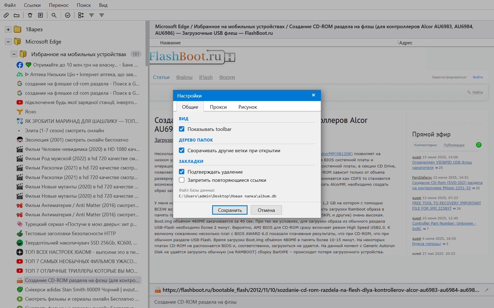
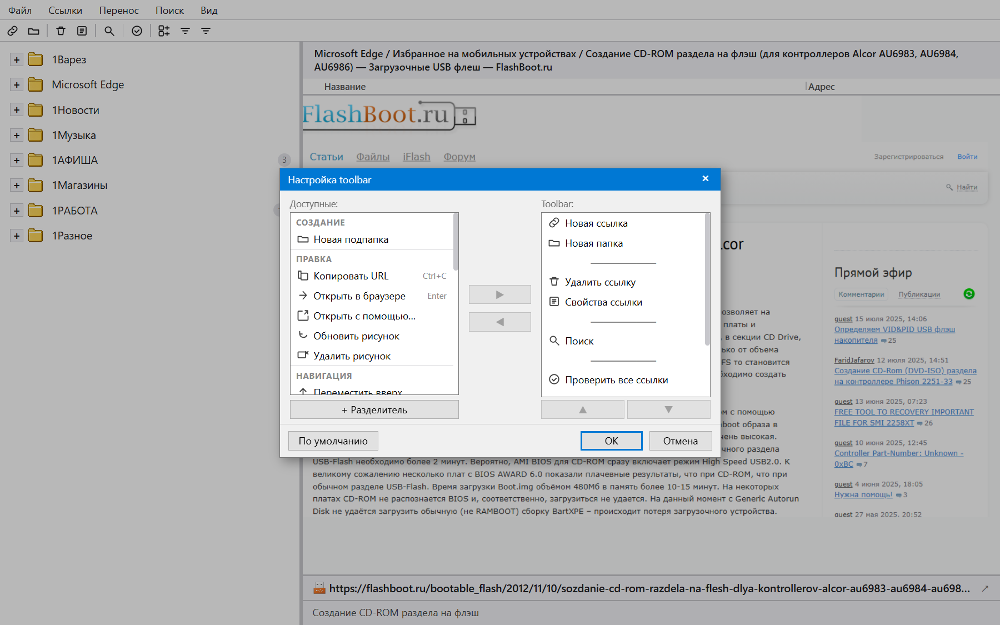

# URL Album 2

**Portable менеджер закладок для Windows 10/11**

Идейный наследник классического URL Album — простой и удобный менеджер закладок, который хранит всё локально, без облака и без слежки.











---

## ⬇ Скачать

**[URL-Album-2.2.0-beta.zip (3.8 MB)](https://github.com/skljar/url-album-tauri/releases/download/v2.2.0-beta/URL-Album-2.2.0-beta.zip)**

Требования: **Windows 10 / 11** (64-bit) — WebView2 уже встроен.

**Новое в 2.2.0-beta (6 июня 2026):** браузерное расширение для Chrome и Edge — сохраняйте ссылки с открытой вкладки одним кликом, программа сама делает скриншот. Ссылки попадают в папку «Входящие». Токен связи настраивается автоматически. Установка расширения — в README.txt внутри архива.

---

## Возможности

### База данных
- Несколько баз данных — переключение на лету
- История последних открытых баз (Файл → Последние базы)
- Свойства базы — путь, размер файла, кол-во папок и ссылок
- Резервная копия со скриншотами и без
- **Portable** — все файлы рядом с exe, реестр не трогается

### Навигация
- Дерево папок в левой панели
- Список ссылок в правой панели (Название / Адрес)
- Drag & Drop — перетаскивание ссылок и папок
- Resizable панели и колонки (сохраняются)

### Ссылки
- Создание, редактирование, удаление
- Открыть в браузере по умолчанию (Enter / двойной клик)
- Открыть с помощью — выбор конкретного браузера
- Заметки к закладкам
- Карточка ссылки с превью скриншота

### Браузерное расширение (Chrome / Edge)
- Сохранить текущую вкладку в URL Album одним кликом
- Программа автоматически делает скриншот страницы
- Ссылки попадают в папку «Входящие»
- Токен связи настраивается без участия пользователя

### Скриншоты сайтов
- Обновить рисунок для одной ссылки
- Пакетное обновление для всей папки (правый клик → Обновить рисунки)
- Настройки: размер, таймаут
- Требуется Edge или Chrome

### Иконки сайтов (favicon)
- Загрузка для одной ссылки или для всей папки рекурсивно
- 4 стратегии поиска: favicon.ico → HTML → DuckDuckGo → Google
- Кэш иконок рядом с базой данных

### Импорт
- Из браузера: **Chrome, Firefox, Edge, Opera, Brave**
- Из файлов: HTML (Netscape bookmarks), TXT (одна ссылка на строку)
- Из старого URL Album (ua.dat)
- Из файла синхронизации (JSON)
- Импорт в конкретную папку (правый клик → Импорт в папку)

### Экспорт
- В HTML файл
- В TXT файл
- В файл синхронизации (JSON)

### Поиск и инструменты
- Поиск по названию, URL, заметке (Ctrl+F)
- Поиск дублирующихся ссылок
- Проверка доступности ссылок

---

## Меню

| Меню | Назначение |
|------|-----------|
| **Файл** | База данных: создать, открыть, последние, резервная копия, свойства |
| **Ссылки** | Операции над закладками |
| **Перенос** | Импорт и экспорт |
| **Поиск** | Поиск по базе |
| **Вид** | Дерево папок, настройка toolbar |

---

## Установка

1. Скачайте ZIP-архив
2. Распакуйте в любую папку
3. Запустите `URL-Album.exe`

При первом запуске: **Файл → Создать базу** или **Файл → Открыть базу**

### Файлы создаются автоматически рядом с exe

```
URL-Album.exe
album.db          ← база закладок
settings.json     ← настройки
toolbar.json      ← настройки тулбара
browsers.json     ← список браузеров
recent_dbs.txt    ← история баз
Data\             ← скриншоты сайтов
Data\favicons\    ← кэш иконок
extension\        ← браузерное расширение (не удалять)
```

---

## Статус: Beta

Программа в активной разработке. Баги и пожелания — в [Issues](https://github.com/skljar/url-album-tauri/issues).

### Пока не реализовано
- Восстановление из резервной копии
- Скриншоты без Edge/Chrome
- Proxy настройки

---

## Технологии

[Tauri 2](https://tauri.app) + Rust + SQLite + Vanilla JS
